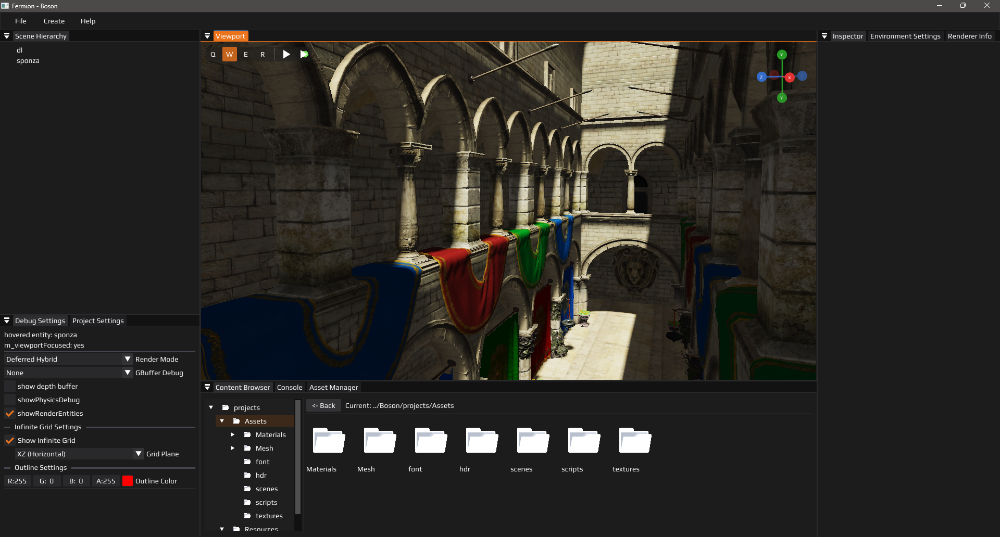
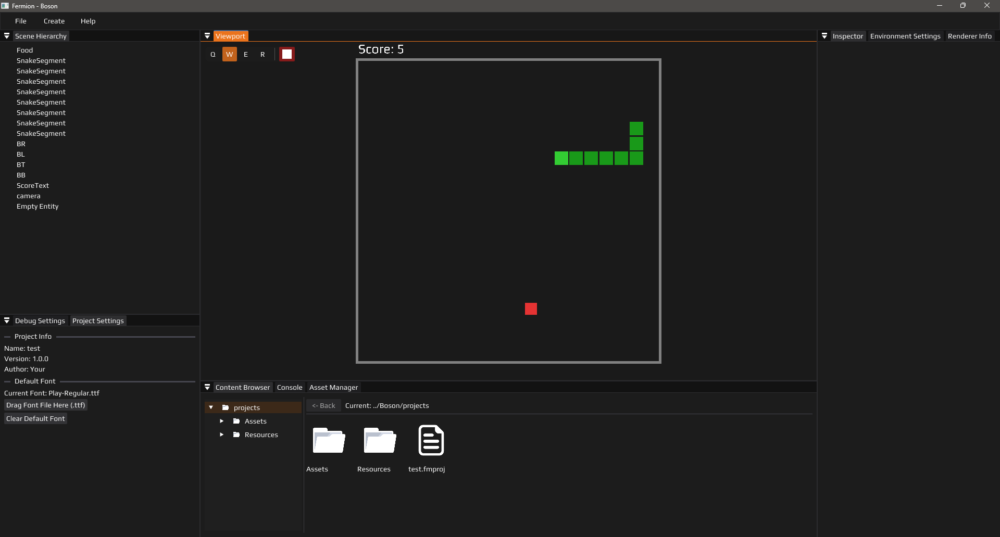
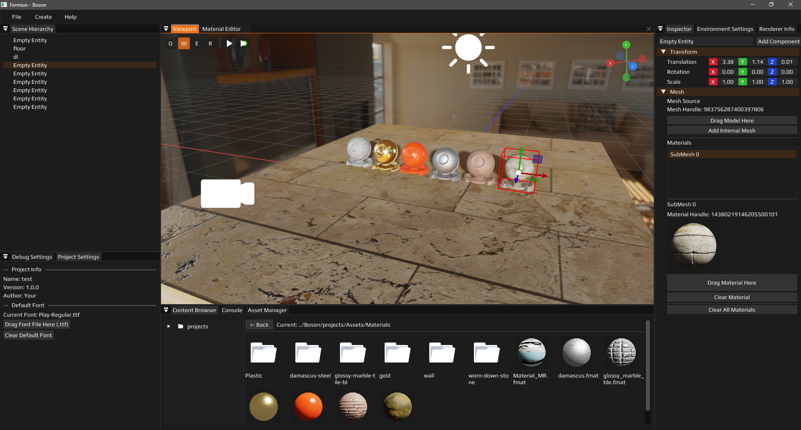
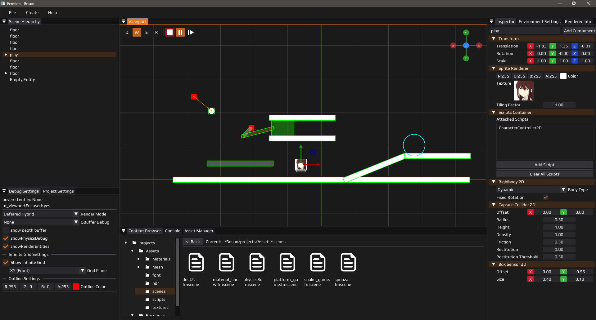
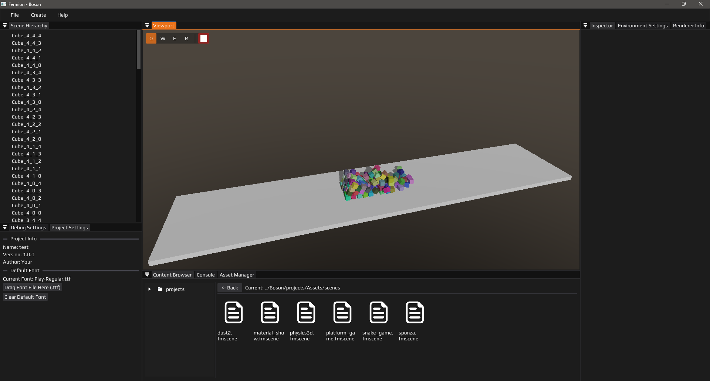

# Fermion

[English](#english) | [中文](#中文)

## 中文

Fermion 是一款基于 C++20 构建的高性能、AI 辅助编程实现的游戏引擎。  
引擎采用 Render Graph 架构。对底层 API 进行了抽象封装，在实现 OpenGL 渲染的同时，具备支持多后端渲染的扩展能力。核心采用 Forward+ 渲染管线，并集成 EnTT 深度支持 ECS 架构。此外，引擎内置了完整的 C# 脚本系统，以及由 Box2D 与 Jolt Physics 驱动的 2D/3D 物理模拟方案。  


## 命名哲学

- **Fermion（费米子）**：对应引擎核心。费米子是构成物质的基本粒子，象征核心运行时负责承载游戏世界中的一切对象与逻辑。
- **Boson（玻色子）**：对应编辑器。玻色子是传递费米子之间的相互作用的媒介粒子，象征编辑器作为开发者与引擎之间的“交互媒介”，用于搭建场景、调整参数、驱动物体。
- **Photon（光子）**: 对应脚本系统。光子是一种玻色子，标志着Photon是编辑器的一部分。并且光子轻、快象征着脚本的轻、快。
- **Neutrino（中微子）**：对应引擎的运行时(Runtime)。中微子是一种费米子，标志着运行时是引擎的一部分。并且中微子几乎不与物质相互作用，就像运行时不直接被玩家看见负责维持内部机制正常运转。

## 演示







## 构建说明

### 环境要求

- CMake ≥ 3.16
- 支持 C++20 的编译器
- Windows/Linux 已经通过编译
- Windows/Linux 需要手动安装 [Mono](https://www.mono-project.com/)

### 获取源码

```bash
git clone https://github.com/Yang-Junjie/Fermion.git
cd Fermion
git submodule update --init --recursive
```

### 配置与编译

```bash
mkdir build
cd build
cmake .. 
cmake --build . --config Release
cd ../bin
../Photon/csbuild.bat
../Boson/projects/Assets/scripts/csbuild.bat
```


## 第三方依赖

项目依赖的库均以源码形式引入，便于跨平台编译与调试：

- [spdlog](https://github.com/gabime/spdlog) – 高性能日志库
- [entt](https://github.com/skypjack/entt) – 实体组件系统（ECS）
- [glm](https://github.com/g-truc/glm) – 数学库（向量、矩阵、变换）
- [Dear ImGui](https://github.com/ocornut/imgui) – 即时模式图形界面
- [ImGuizmo](https://github.com/CedricGuillemet/ImGuizmo) – 编辑器中的变换 Gizmo
- [GLFW](https://github.com/glfw/glfw) – 跨平台窗口与输入管理
- [GLAD](https://glad.dav1d.de/) – OpenGL 函数加载器
- [stb](https://github.com/nothings/stb) – 使用进行纹理加载和保存
- [yaml-cpp](https://github.com/jbeder/yaml-cpp) – YAML 序列化（场景保存/加载）
- [box2d](https://github.com/erincatto/box2d) – 2D 刚体物理引擎
- [msdf-atlas-gen](https://github.com/Chlumsky/msdf-atlas-gen) - MSDF 纹理生成
- [freetype](https://github.com/freetype/freetype) - FreeType 字体库
- [Mono](https://github.com/mono/mono) - 跨平台 .NET 运行时，用于在引擎中运行 C# 脚本。
- [Assimp](https://github.com/assimp/assimp) - 3D 模型加载
- [JoltPhysics](https://github.com/jrouwe/JoltPhysics) - 3D物理引擎
- [ImguiNodeEditor](https://github.com/thedmd/imgui-node-editor) - 节点编辑器
- [ImViewGuizmo](https://github.com/Ka1serM/ImViewGuizmo) - View Gizmo

## 参考
- [Hazel](https://github.com/TheCherno/Hazel.git) 跟着这个教程走的，后期自己进行扩展

## 许可证

本项目基于 MIT License 开源，详情请见 `LICENSE` 文件。

---

## English

Fermion is a high-performance game engine built with C++20 and AI-assisted programming.
The engine features a Render Graph architecture with abstracted low-level API encapsulation, currently implementing OpenGL rendering while maintaining extensibility for multi-backend support. It utilizes a Forward+ rendering pipeline and deeply integrates EnTT for ECS architecture. Additionally, the engine includes a complete C# scripting system and 2D/3D physics simulation powered by Box2D and Jolt Physics.

## Naming Philosophy

- **Fermion**: Represents the engine core. Fermions are fundamental particles that constitute matter, symbolizing the core runtime responsible for hosting all objects and logic in the game world.
- **Boson**: Represents the editor. Bosons are mediator particles that transmit interactions between fermions, symbolizing the editor as an "interaction medium" between developers and the engine, used for building scenes, adjusting parameters, and driving objects.
- **Photon**: Represents the scripting system. Photons are a type of boson, indicating that Photon is part of the editor. The lightness and speed of photons symbolize the lightweight and fast nature of scripts.
- **Neutrino**: Represents the engine's runtime. Neutrinos are a type of fermion, indicating that the runtime is part of the engine. Neutrinos barely interact with matter, just as the runtime is not directly visible to players but maintains the internal mechanisms.

## Showcase


## Build Instructions

### Requirements

- CMake ≥ 3.16
- C++20 compatible compiler
- Tested on Windows/Linux
- Windows/Linux require manual installation of [Mono](https://www.mono-project.com/)

### Clone Repository

```bash
git clone https://github.com/Yang-Junjie/Fermion.git
cd Fermion
git submodule update --init --recursive
```

### Configure and Build

```bash
mkdir build
cd build
cmake ..
cmake --build . --config Release
cd ../bin
../Photon/csbuild.bat
../Boson/projects/Assets/scripts/csbuild.bat
```

## Third-Party Dependencies

All dependencies are included as source code for cross-platform compilation and debugging:

- [spdlog](https://github.com/gabime/spdlog) – High-performance logging library
- [entt](https://github.com/skypjack/entt) – Entity Component System (ECS)
- [glm](https://github.com/g-truc/glm) – Mathematics library (vectors, matrices, transformations)
- [Dear ImGui](https://github.com/ocornut/imgui) – Immediate mode GUI
- [ImGuizmo](https://github.com/CedricGuillemet/ImGuizmo) – Transform gizmo for editor
- [GLFW](https://github.com/glfw/glfw) – Cross-platform window and input management
- [GLAD](https://glad.dav1d.de/) – OpenGL function loader
- [stb](https://github.com/nothings/stb) – Texture loading and saving
- [yaml-cpp](https://github.com/jbeder/yaml-cpp) – YAML serialization (scene save/load)
- [box2d](https://github.com/erincatto/box2d) – 2D rigid body physics engine
- [msdf-atlas-gen](https://github.com/Chlumsky/msdf-atlas-gen) – MSDF texture generation
- [freetype](https://github.com/freetype/freetype) – FreeType font library
- [Mono](https://github.com/mono/mono) – Cross-platform .NET runtime for C# scripting in the engine
- [Assimp](https://github.com/assimp/assimp) – 3D model loading
- [JoltPhysics](https://github.com/jrouwe/JoltPhysics) – 3D physics engine
- [ImguiNodeEditor](https://github.com/thedmd/imgui-node-editor) – Node editor
- [ImViewGuizmo](https://github.com/Ka1serM/ImViewGuizmo) – View gizmo

## References

- [Hazel](https://github.com/TheCherno/Hazel.git) – Initial learning resource, later extended with custom features

## License

This project is open-sourced under the MIT License. See the `LICENSE` file for details.
