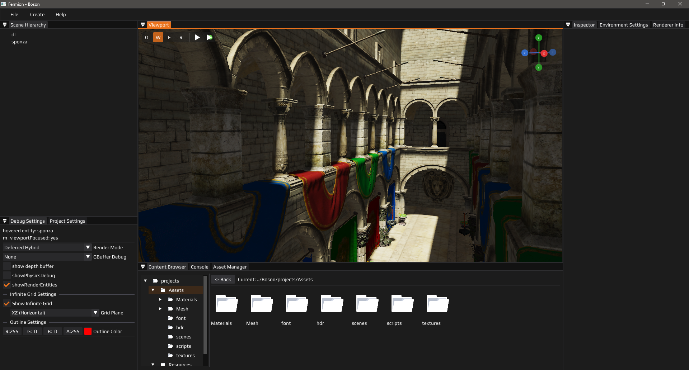
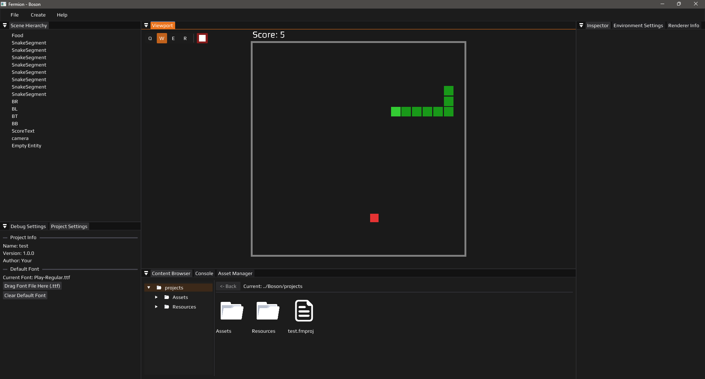
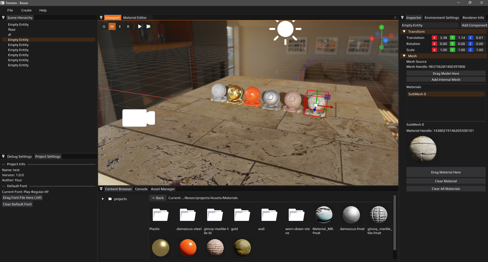
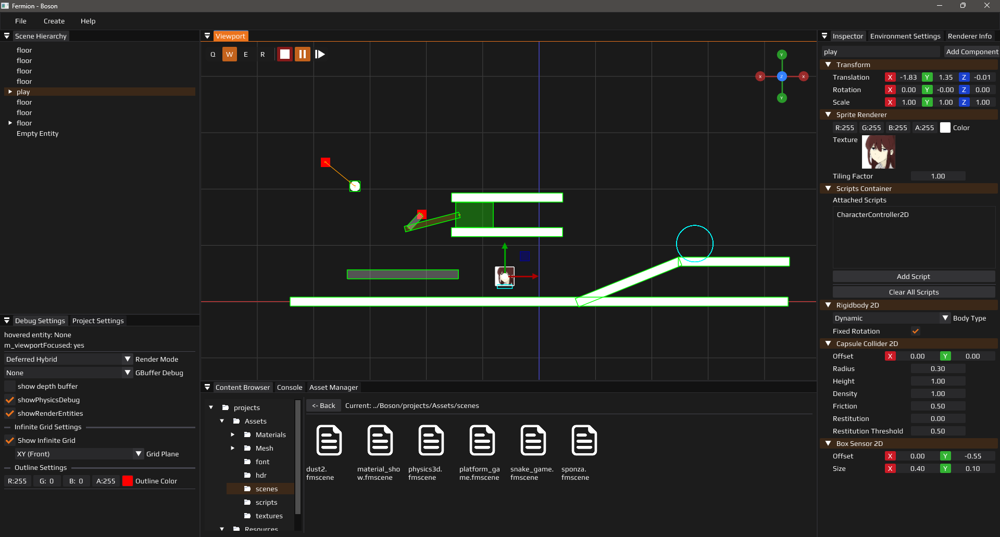
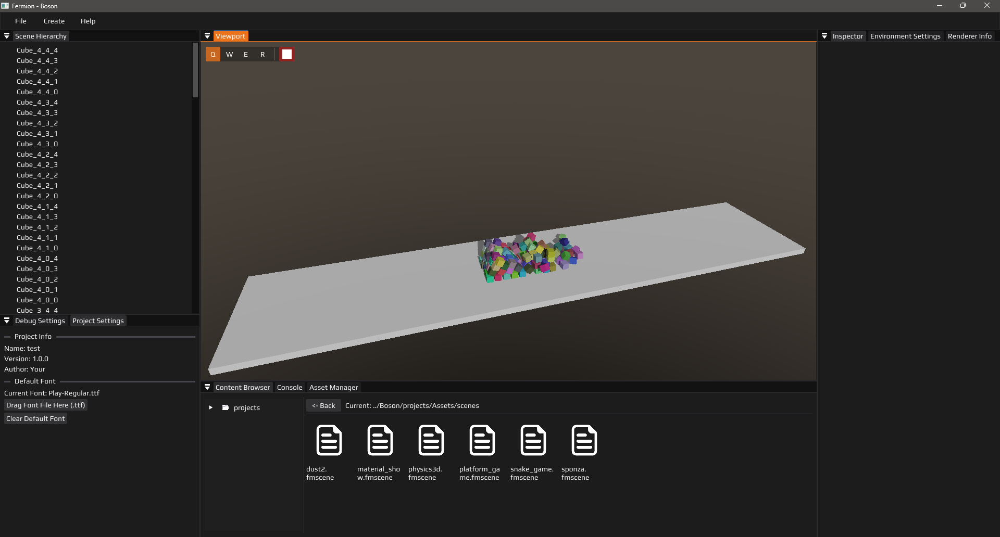

# Fermion

[中文](./README_CN.md)

Fermion is a high-performance game engine built with C++20 and AI-assisted programming.
The engine features a Render Graph architecture with abstracted low-level API encapsulation, currently implementing OpenGL rendering while maintaining extensibility for multi-backend support. It utilizes a Forward+ rendering pipeline and deeply integrates EnTT for ECS architecture. Additionally, the engine includes a complete C# scripting system and 2D/3D physics simulation powered by Box2D and Jolt Physics.

## Naming Philosophy

- **Fermion**: Represents the engine core. Fermions are fundamental particles that constitute matter, symbolizing the core runtime responsible for hosting all objects and logic in the game world.
- **Boson**: Represents the editor. Bosons are mediator particles that transmit interactions between fermions, symbolizing the editor as an "interaction medium" between developers and the engine, used for building scenes, adjusting parameters, and driving objects.
- **Photon**: Represents the scripting system. Photons are a type of boson, indicating that Photon is part of the editor. The lightness and speed of photons symbolize the lightweight and fast nature of scripts.
- **Neutrino**: Represents the engine's runtime. Neutrinos are a type of fermion, indicating that the runtime is part of the engine. Neutrinos barely interact with matter, just as the runtime is not directly visible to players but maintains the internal mechanisms.

## Showcase







## Build Instructions

### Requirements

- CMake >= 3.16
- C++20 compatible compiler
- Tested on Windows/Linux
- Windows/Linux require manual installation of [Mono](https://www.mono-project.com/)

### Clone Repository

```bash
git clone https://github.com/Yang-Junjie/Fermion.git
cd Fermion
git submodule update --init --recursive
```

### Configure and Build

```bash
mkdir build
cd build
cmake ..
cmake --build . --config Release
cd ../bin
../Photon/csbuild.bat
../Boson/projects/Assets/scripts/csbuild.bat
```

## Third-Party Dependencies

All dependencies are included as source code for cross-platform compilation and debugging:

- [spdlog](https://github.com/gabime/spdlog) - High-performance logging library
- [entt](https://github.com/skypjack/entt) - Entity Component System (ECS)
- [glm](https://github.com/g-truc/glm) - Mathematics library (vectors, matrices, transformations)
- [Dear ImGui](https://github.com/ocornut/imgui) - Immediate mode GUI
- [ImGuizmo](https://github.com/CedricGuillemet/ImGuizmo) - Transform gizmo for editor
- [GLFW](https://github.com/glfw/glfw) - Cross-platform window and input management
- [GLAD](https://glad.dav1d.de/) - OpenGL function loader
- [stb](https://github.com/nothings/stb) - Texture loading and saving
- [yaml-cpp](https://github.com/jbeder/yaml-cpp) - YAML serialization (scene save/load)
- [box2d](https://github.com/erincatto/box2d) - 2D rigid body physics engine
- [msdf-atlas-gen](https://github.com/Chlumsky/msdf-atlas-gen) - MSDF texture generation
- [freetype](https://github.com/freetype/freetype) - FreeType font library
- [Mono](https://github.com/mono/mono) - Cross-platform .NET runtime for C# scripting in the engine
- [Assimp](https://github.com/assimp/assimp) - 3D model loading
- [JoltPhysics](https://github.com/jrouwe/JoltPhysics) - 3D physics engine
- [ImguiNodeEditor](https://github.com/thedmd/imgui-node-editor) - Node editor
- [ImViewGuizmo](https://github.com/Ka1serM/ImViewGuizmo) - View gizmo

## References

- [Hazel](https://github.com/TheCherno/Hazel.git) - Initial learning resource, later extended with custom features

## License

This project is open-sourced under the MIT License. See the `LICENSE` file for details.
